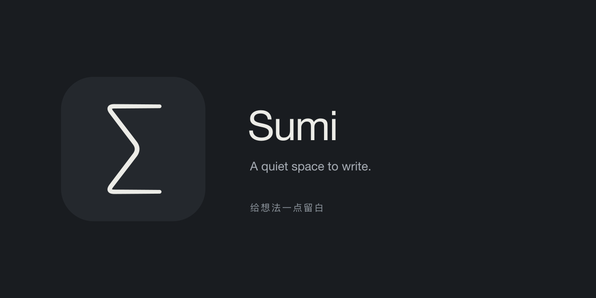

  <a href="https://github.com/leftblank-app/leftblank/releases"><strong>Download LeftBlank Preview</strong></a>
  &nbsp; · &nbsp;
  <a href="https://leftblank.app">Visit the website</a>
  &nbsp; · &nbsp;
  <a href="https://github.com/leftblank-app/leftblank/issues">Share an idea</a>

LeftBlank is a quiet place to write, think, and shape a beautiful page. Start with a
thought. Follow it into an essay, a set of notes, or a whole book.

A spacious editor keeps your words in focus. The finished page takes shape beside
them, from the first heading to the last equation. Light and dark appearances
bring the same sense of calm, at any hour.

### Room for your ideas

**Write at your own pace.** An outline waits in the margin. Autosave looks after
your draft. A small history of earlier versions lets you compare, revisit, and
restore your writing.

**Discover as you go.** Press ⌘J to find a tool or learn its shortcut. Browse
purposeful templates and packages when a page needs a diagram, a table, or a new
way to tell the story.

**Make something worth sharing.** See your writing become carefully typeset
pages as you work, then export a PDF. Begin with the included LeftBlank guide, a blank
page, or an editable copy of *Structure and Interpretation of Computer Programs*.

### Begin a new page

[Download LeftBlank Preview →](https://github.com/leftblank-app/leftblank/releases)

For macOS 14 or later on a Mac with an Apple M-series chip. English and Simplified
Chinese are included. Everything needed to write and preview comes with the app.

LeftBlank is still taking shape. Preview builds have a separate local library and
receive signed updates; iCloud sync is not enabled in Preview.
[About Preview](docs/preview-updates.md)

---

  <strong>留白</strong> 
  此中有真意，欲辨已忘言

  <a href="docs/writing-guide.md">Writing guide</a> ·
  <a href="docs/development.md">Development</a> ·
  <a href="docs/agents.md">Working with agents</a> ·
  <a href="Brand/README.md">The Σ mark</a>

  
  

### Swift code quality

Run `scripts/lint.sh` before committing Swift changes. It installs checksum-pinned
SwiftFormat 0.63.1 and SwiftLint 0.64.1 into `.tools/`. Use
`scripts/lint.sh --fix` for automatic corrections, then fix remaining diagnostics.
Both tools run on the package manifest, Sources, Tests, Benchmarks, scripts and
design probes. Dependencies and generated build files are outside this scope.

CI and release workflows enforce canonical formatting and 139 SwiftLint rules
covering correctness, safety, performance and Swift idioms. Every lint warning fails
the check, and test builds also treat compiler warnings as errors. There is no
baseline or file-specific suppression. SwiftFormat owns layout; SwiftLint rules intentionally preserve AppKit bridging, Swift inference
model optionals and test names used by CI filters instead of requiring boilerplate. Signed packages wait for
the lint check to pass. Update tool versions and archive checksums together.
