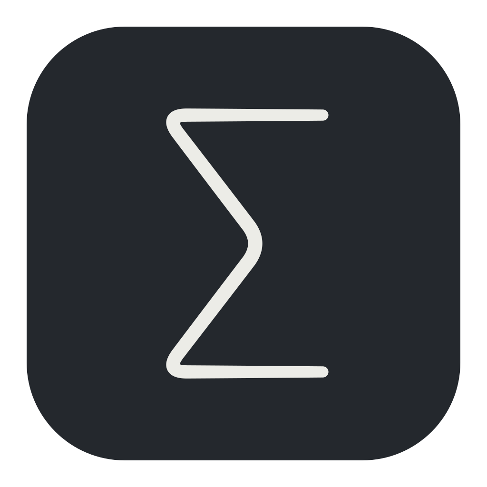

# Sumi



[](https://github.com/fenjin-ai/sumi/actions/workflows/ci.yml) [](https://app.codecov.io/github/fenjin-ai/sumi)

**A quiet space to write.**

Sumi gives your words room to breathe. A calm interface, tools you can discover as you go, and a live view of the finished page keep your attention on writing and thinking.

- [Product requirements](docs/requirements.md)
- [Architecture](docs/architecture.md)
- [Implementation and verification](docs/progress.md)
- [Writing features](docs/editor-evolution.md)
- [Interaction and performance](docs/interaction.md)
- [Brand assets and favicons](Brand/README.md)
- [Localization](docs/localization.md)
- [Library and synchronization](docs/library-and-sync.md)
- [Coding agents and MCP](docs/agents.md)
- [Code notes](docs/code-notes.md)
- [Local intelligence evaluation](docs/local-intelligence.md)
- [Merge evaluation](docs/merge-evaluation.md)

## Getting started

Sumi is a development preview for Macs with an Apple M-series chip, running macOS 14 or later.

Open `build/Sumi.app` after building. The app includes its typesetting service; no separate installation of Typst, Rust or Homebrew is needed to use it. Try the [welcome document](Examples/Welcome.typ).

The app supports English and Simplified Chinese. Choose **Settings → App Language** to follow your system or use either language immediately. Changing the interface language never translates or rewrites your documents.

| Action | Shortcut |
|---|---|
| Discover commands | `⌘J`, configurable as `⌘K` |
| Browse categories | `i` Insert, `s` Text Style, `p` Page Setup, `m` Mathematics, `l` Typesetting, `r` References, `c` Editing & Code, `v` Workspace, `f` Documents |
| Search commands | `/` inside the command panel; English and Chinese queries work in either interface language |
| Go back or dismiss | `Esc` |
| Move between inserted placeholders | `Tab` / `⇧Tab`; `Esc` to finish |
| Writing / side-by-side / preview | `⌘1` / `⌘2` / `⌘3` |
| Outline / document checks | `⌘4` / `⌘5` |
| New / library / save | `⌘N` / `⌘O` / `⌘S` |
| Import a document | `⇧⌘O` |
| Save as / export PDF | `⇧⌘S` / `⇧⌘E` |
| Completion / find | `⌃.` / `⌘F` |
| Universe packages | `⇧⌘U` |

For example, `⌘J → i → t` opens the table form. Choose the row and column counts, insert, then move between cells with Tab. Select text and press `⌘J → s → b` to make it bold. Each insertion is one undoable edit. You can always write Typst directly.

The command catalog has 109 discoverable commands, including 74 insertion actions. Mathematics has nested categories for basic operations, equation structures and symbols. `⌘J → m → b → f` inserts a fraction, using the appropriate syntax inside an existing equation. Commands show their purpose, example, direct shortcut, discovery path and official reference.

Frequent actions have direct shortcuts as well as discoverable paths. `⌘]` / `⌘[` indent and outdent, `⌘/` toggles comments, and `⌥⇧F` formats the source. Hovering a toolbar button shows a compact action name and shortcut.

The outline appears in the left margin without moving the text. Hover to explore headings, then use the small pin to keep them visible; hovering the pinned control reveals its close action. `⌘4` also pins or dismisses it. The command panel keeps a stable height through searching, selection and parameter entry; its guide stays in the same place.

## Writing and preview

Editor styling gently emphasizes headings, bold, italics and inline code. Moving the caret into a paragraph reveals its full source. Copying, saving and undo always use the original text. Toggle styling with `⌘J → v → t`.

The preview shows real typeset pages. Double-click a page to reveal the source; source selection can locate the corresponding preview position. Zoom is relative to the preview pane's fitted width. Dark preview changes screen colors only; images retain their colors and exported PDFs are unchanged.

While syntax is incomplete or invalid, Sumi retains the last successful preview and marks it as out of date. Rendering only visible page regions reduces display work; it does not mean every invalid document can compile partially. Export fails on a compilation error instead of silently exporting an old PDF.

**Universe** searches the official package index by name, purpose and category. Browse drawing or diagram packages, check their documentation, and insert a pinned version. The index is cached for 24 hours and remains available offline. Packages that need a newer typesetting engine cannot be imported through the browser.

The library presents document titles and searchable content without requiring you to manage source filenames. Import a document or an entire project folder, rename it, or move it to the recoverable Trash. Source projects remain exportable. Command-N opens Templates, with an offline blank page and an original Sumi guide featuring equations, a diagram, a table and numbered code. The guide’s pinned packages are included; code is displayed, not executed. New writing and existing files autosave after a short pause and retain a local recovery copy. Sumi preserves the current draft before switching documents, and refuses to silently overwrite a file changed by another application. **Documents → Recover Draft Copy** reopens preserved drafts.

Local coding agents can use the opt-in MCP bridge to read the live document, make undoable revision-checked edits, browse the library, change writing preferences and export previews. Enable **Settings → Agent Access** and copy the Codex setup command. See [agent setup](docs/agents.md).

iCloud support is under development. It requires a properly provisioned release and an iCloud Drive account; local development builds clearly report when unavailable. Real two-Mac delivery and conflict recovery remain release checks. See [sync status and limitations](docs/library-and-sync.md).

## Diagnostic logs

Use **View → Open Diagnostic Logs** or `⌘J → v → g` to reveal `~/Library/Application Support/Sumi/Logs/events.jsonl`. The current log rotates at about 1 MiB and retains three archives.

Logs record sessions, versions, event order, command/navigation keys, insertion and save/export outcomes, selection ranges and service failures. Ordinary typing is recorded only as a `text` event. Document text, clipboard contents, search terms and field values are not logged. System error messages may contain file paths. Logs stay on the Mac; keep them alongside a macOS crash report when investigating a problem.

## Building and testing

Sumi uses SwiftUI and AppKit for the app and editing experience, with Tinymist as a managed child process for Typst language services and preview. Documents use ordinary `.typ` source and relative assets. The visual approach was inspired by Nano Emacs.

Use Xcode 26 or later with a Swift 6.2 or later toolchain and the macOS SDK. Local development scripts expect the external development volume at `/Volumes/SSD/Developer`; run from an SSD checkout:

```sh
scripts/build.sh release
scripts/test.sh
```

The build downloads Tinymist **0.15.8** (Typst 0.15.1), verifies its pinned SHA-256, and produces `build/Sumi.app` with an ad hoc development signature. Functional tests exercise the real native editor, workspace, windows, WebKit preview and Tinymist process: discovery, insertion, undo/redo, Unicode, recovery, multiple files, compilation errors and PDF output. Small boundary tests cover text ranges, protocol framing and index validation.

`scripts/test.sh` writes HTML, raw coverage data and `build/coverage/summary.md`. It requires **80% coverage of unique executable lines across production Swift sources**, including the interface. LCOV records are deduplicated by source file and line to avoid counting SwiftUI generic instantiations repeatedly. Plain `swift test` omits explicitly enabled integration scenarios and does not enforce coverage.

GitHub Actions uses `macos-15` with Xcode 26.3 for both pull requests and signed releases. The `build and test` check must pass on an up-to-date pull request before merging. It checks functional coverage (at least 80%), exercises the agent bridge with a single cooperative worker, runs book benchmarks, and uploads reports and development packages. Swift package sources are cached; application binaries are rebuilt. [Codecov](https://app.codecov.io/github/fenjin-ai/sumi) reports project and patch coverage, including PR comments. A version tag matching `Info.plist` triggers testing and a release ZIP with SHA-256. Public releases require Developer ID signing, successful Apple notarization, ticket stapling and Gatekeeper validation. See [release signing](docs/signing.md); ordinary CI packages remain development builds.

The source is split into the launcher, testable native app, core document logic and local agent integration. Bundled third-party licenses are listed in `Resources/ThirdParty.txt`.

## Scope and verification

Sumi remains a development preview. It has one active editing buffer, with the main compilation entry preserved when navigating into included files. It does not provide collaborative accounts, Vim emulation, arbitrary visual editing of typeset pages or an automatic updater.

Unicode editing, marked-text protection, undo and saving have automated coverage. Complete third-party input-method and VoiceOver flows, and a physical Mac running macOS 14, still need manual verification. Real 1.4 MB SICP and 3.3 MB War and Peace fixtures exercise highlighting, typing, pointer placement and scrolling in [book benchmarks](docs/large-document-performance.md). [Template and package discovery](docs/discovery.md) includes a downloadable, editable SICP example; [the complete books and conversion scripts](Examples/Books/README.md) are checked in with their own attribution and licenses. Verification evidence and remaining limitations live in [the progress record](docs/progress.md).
