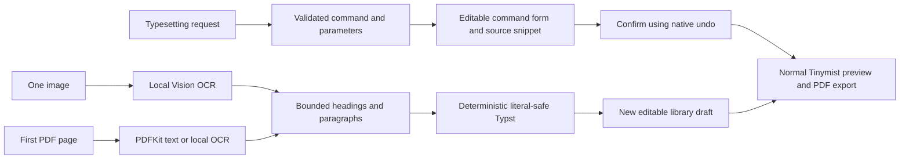

# Apple Intelligence integration roadmap

Research and decisions updated October 3, 2026. The user approved natural-language typesetting and a small image/PDF-to-editable-Typst workflow. The first implementation is present and locally validated on October 3; it has not been released. The remaining features below are proposals for evaluation, not shipped behavior.

The user subsequently asked to evaluate the device model before choosing scenarios. The [direct capability study](device-model-capabilities-2026-10-03.md) now prioritizes topic-tag suggestions, source-linked chapter excerpts and bounded read-only document lookup. The earlier typesetting/reconstruction implementation remains a draft experiment and is deferred as a release candidate; regression validation did not establish useful production quality.

## Product direction

Make LeftBlank a reliable place to turn materials into editable, well-typeset documents. Apple models can interpret a person's request or classify extracted text; LeftBlank should own source generation, compilation, revision checks and undo. A document remains an ordinary `.typ` file with editable source.

The existing [agent workflow](agents.md) already provides bounded document reads, atomic edits, native undo, compiler diagnostics, rendered-page review and PDF export. The [October 3 effect evaluation](intelligence-effect-evaluation-2026-10-03.md) measured the implemented resolver on 100 bilingual requests and rendered 11 reconstruction inputs. Results support a limited experiment, not production release: strict request accuracy was 59/100, and layout/structure reconstruction has substantial gaps. The older [local-intelligence probe](local-intelligence.md) remains historical feasibility evidence.

## Opportunities and priorities

Effort is a relative engineering estimate, not a delivery commitment. The descriptions separate documented Apple capabilities from LeftBlank product hypotheses.

| Idea | User outcome | Effort | Priority and status |
| --- | --- | --- | --- |
| Natural-language typesetting | Describe an insertion or page style and get an editable result | Small–medium | First; approved |
| Materials-to-PDF workflows | Turn text from another app into a document and return a PDF through Shortcuts | Medium | Next ecosystem integration to evaluate |
| Ask the document library | Find old arguments and examples with original chapter locations | Medium–large | Long-term product investment |
| Siri idea inbox | Capture an idea and continue writing on Mac/iPad | Medium | Evaluate after useful App Intents exist |
| Structure-aware Writing Tools | Polish prose while preserving Typst syntax, formulas and code | Medium | Practical editor enhancement to evaluate |
| Visual page review | Find potential layout problems in actual rendered pages | Large | Experiment before committing |
| One-page reconstruction | Convert one image or PDF page into simple editable Typst | Medium | First; approved with limited scope |

### Natural-language typesetting

A person can ask “插入 Python 代码块,” “做一个三列表格,” or request a supported page setting. Numbered code blocks require a future operation and currently return an unsupported result. Retrieve actual commands or presets, choose a validated ID and bounded parameters, then use deterministic insertion code. Present the proposed source or resulting page before acceptance; the final change follows the existing undo path.

Apple documents extraction and classification as suitable model tasks and cautions about code and mathematics. This supports using a model to choose known operations; it does not establish that the model can reliably write arbitrary Typst. [Foundation Models capabilities](https://developer.apple.com/documentation/foundationmodels/generating-content-and-performing-tasks-with-foundation-models)

The product hypothesis is that ordinary Chinese/English requests improve command discovery over keyword search. Compare both approaches with ambiguous requests, unsupported operations and requests whose correct result is “no supported action.”

### Materials-to-PDF workflows

Example: select meeting materials, use Shortcuts' **Use Model** action to produce a summary, create a LeftBlank document from a technical-report template, export its current revision as PDF, then hand the file to the system share workflow.

Apple supports composing App Intents with model actions in Shortcuts. Start with explicit text, title and template inputs, plus a PDF output. [Apple Intelligence and Shortcuts](https://developer.apple.com/apple-intelligence/)

The `wordProcessor.document` schema currently lists Shortcuts as its supported system experience. It is useful for document workflows, but adopting it alone does not establish arbitrary Siri editing support. [Word processor document schema](https://developer.apple.com/documentation/appintents/appschema/wordprocessorentity/document)

Evaluate one complete materials-to-PDF workflow before expanding the intent catalogue. Exports must use the requested revision and fail on compilation errors, matching the existing editor contract.

### Ask the document library

Example: “找出我以前讨论数据库连接池的文章” or “这段观点有哪些旧稿可以支持？” Return original excerpts, document titles and chapter locations. Begin with useful semantic retrieval, then add answers grounded in a small set of retrieved sections.

Apple's 27-generation `SpotlightSearchTool` can connect a language-model session to the app's Core Spotlight index. Full source content may need to be supplied through the index delegate because searchable compact metadata cannot always be recovered as readable text. [LLM search using Core Spotlight](https://developer.apple.com/videos/play/wwdc2026/246/)

Our proposed indexing unit is a chapter or bounded section with a document ID, revision and source location. This is a LeftBlank design choice, not an Apple requirement. Index deletion, changes, source navigation and user control need explicit behavior. The tool searches the app's own content; materials from other apps still need an authorized import/share workflow. [Apple Intelligence integration scope](https://developer.apple.com/videos/play/wwdc2026/8011/)

### Siri idea inbox

Example: capture a spoken idea as a note and expand it later into a document. Notes schemas can describe genuine note creation/append operations, while system/in-app search provides a discovery entry point. Custom App Shortcuts can expose LeftBlank-specific operations. Match each schema to the app's actual behavior rather than relabeling every document as a note. [Notes schemas](https://developer.apple.com/documentation/appintents/appschema/notesintent), [system and in-app search](https://developer.apple.com/documentation/appintents/app-schema-domain-system-and-in-app-search)

As checked on October 3, 2026, Siri AI is an English beta with a waitlist. Apple Accounts set to mainland China cannot currently use it. These restrictions concern the new Siri AI experience; they are not a blanket statement about all Shortcuts or existing Siri functionality. Establish Chinese in-app and Shortcuts workflows independently of new Siri availability. [Siri AI availability](https://support.apple.com/en-us/127893)

### Structure-aware Writing Tools

Offer proofreading or concise rewriting for a selected prose passage. Preserve equations, code, references and Typst directives, and review the original against the proposed prose before a single undoable replacement.

The Mac manuscript editor uses TextKit 1. Apple says the full inline Writing Tools experience requires TextKit 2; TextKit 1 offers a limited panel experience. Apple also provides ignored-range hooks for protecting text. [Writing Tools integration](https://developer.apple.com/videos/play/wwdc2024/10168/)

A first experiment can use a separate prose review view, avoiding an immediate editor migration. Reliable Typst prose boundaries and revision-safe replacement remain LeftBlank work; system Writing Tools does not automatically understand Typst source structure.

### Visual page review

Example: inspect three rendered pages for unexpectedly large whitespace, tiny captions or unclear heading hierarchy, then return page-specific suggestions. Suggestions should map to a small set of known layout changes with before/after rendering.

Apple's 27-generation model accepts image attachments. It does not promise reliable document-layout critique. Test annotated pages with known defects and clean controls before presenting this as a dependable feature. [Foundation Models image input](https://developer.apple.com/videos/play/wwdc2026/241/)

This experiment is distinct from the approved OCR reconstruction: visual review judges rendered layout, while the first reconstruction only recovers editable text and simple structure.

## Approved first implementation

### Scope and user journey

Start on Mac and keep deterministic document rules in `LeftBlankCore` for later iPad use, consistent with the [shared-core architecture](ipad-architecture.md). There are two connected entry points:

1. Describe a supported typesetting change in English or Chinese. Review a proposed command, editable parameters and its source snippet, then confirm the operation and inspect the normal compiled preview.
2. Choose one image or a PDF. For PDF input, process the first page only and make that scope visible. Extract the text and recover simple structure into a new library draft. Review and edit its Typst source beside the normal compiled preview.

The reconstruction target is a simple page containing headings and paragraphs. Lists and rectangular text tables can be added when the shared schema and generator support them safely; accurate table detection is a separate quality problem. Begin with plain, mostly single-column pages. Multi-page import, complex columns, merged cells, exact font/pagination matching, handwriting, formula recovery, diagrams and embedded-asset reconstruction are future work.

Recovering editable content is the acceptance goal. A PDF stores rendered output rather than the original authoring structure; matching its exact original Typst source is not promised. OCR may misread characters and reading order, so keep the recovered text visible for correction.

### Processing design

Use PDFKit's native text for a text PDF, with OCR for an image or scanned page. Vision OCR and PDFKit remain compatible with the macOS 14 baseline. Optional Foundation Models text inference is gated to macOS 26+ and checks actual model availability. Keep the implementation buildable with the pinned Xcode 26.3 CI SDK; do not introduce SDK-27-only model attachments for the first image/PDF workflow. [PDFKit](https://developer.apple.com/documentation/pdfkit), [Vision text recognition](https://developer.apple.com/documentation/vision/recognizing-text-in-images)

The implemented optional model selects an allowed operation from a constrained schema, then extracts only that operation's fields in a fresh session. Page reconstruction uses local extraction and deterministic structure rules; model-assisted page classification is future work. Source is generated from that validated representation. Literal content must be escaped so a photograph of `#import`, `$...$` or other Typst syntax becomes content rather than executable source. Treat prompts, OCR text and model output as untrusted input; invalid IDs, excessive blocks or unsupported shapes cannot reach document mutation.

Perform extraction, OCR and inference asynchronously. Bound file/pixel/text/output sizes and keep one cancellable request per workflow. Reject stale command suggestions. If writing changes during reconstruction, keep the completed draft in the library without switching the editor away from that writing. No automatic overwrite, background library scan, source logging or silent cloud substitution. An unavailable model should preserve useful deterministic import/search behavior and explain the available path.

Compilation and rendered review use the normal Tinymist pipeline. Successful compilation establishes valid output, not OCR accuracy or visual fidelity. Command acceptance must preserve saving, selection and native undo behavior. Reconstruction creates a new draft and preserves the original; its normal compiler diagnostics remain visible and a compile failure must not be presented as a successful preview.

### Evidence required before release

Local validation on October 3:

- The complete repository test script passed, including the separately built macOS MCP helper, Swift core/automation tests, native writing flows and the 80% application coverage gate. The final run passed 194 Swift tests and recorded 85.59% application source-line coverage (11,607/13,561 lines), exceeding the required 80%.
- Native fixtures cover text PDFs, a scanned PDF, image OCR, first-page-only import, blank/corrupt/encrypted files, file/pixel bounds, cancellation, literal safety, draft editing and PDF export.
- Command-flow tests cover editable parameters before acceptance, native undo/redo, rejected suggestions, changed queries, closed palettes and stale/cancelled draft navigation.
- An opt-in real-model smoke test on the local macOS 27 machine passed three synthetic requests: an indirect Chinese bold request, an indirect English Rust code-block request with a language parameter, and an unsupported request returning no action. No personal manuscript was supplied. The initial flat schema invented an unrelated parameter for bold; the final implementation uses a constrained command schema and a separate schema containing only the chosen command's fields.
- `scripts/lint.sh --lint` passed. The shared core also built for an iOS 17 simulator deployment target. Local builds used Xcode 27; the pinned Xcode 26.3 CI toolchain and older operating systems have not been executed locally.

The initial input set is deliberately small. Continue evaluating these targets before a broad release:

- Validate deterministic output against the real compiler, including Chinese/English headings, paragraphs and supported tables, plus strings containing Typst control syntax.
- Exercise native PDF text extraction, image/scanned-page OCR, empty/corrupt input, first-page-only behavior and bounded oversized input handling with disposable local fixtures.
- Verify cancellation, unavailable/disabled Apple Intelligence, rejected model output, revision changes and a single undo after acceptance. Deterministic tests should inject model results rather than require real Apple Intelligence availability.
- Inspect the actual review flow in the running Mac app; compare extracted text and compiled pages with representative one-page inputs.
- Evaluate the real local model separately on bilingual requests and simple page structure. The October 1 four-request probe is historical evidence only. Keep broader model-quality and editor-latency targets in [local-intelligence.md](local-intelligence.md).

## Private Cloud Compute access

### Documented eligibility and product boundary

Apple requires App Store Small Business Program enrollment, fewer than two million first-time App Store downloads for each app, and a managed PCC entitlement. Eligible apps use PCC through App Store distribution; testing can use TestFlight or ad hoc distribution. If eligibility is later lost, Apple's current policy provides six months to migrate. This does not establish PCC access for LeftBlank's direct/Preview distribution. [PCC access and entitlement](https://developer.apple.com/private-cloud-compute/)

The PCC model is available on macOS 27+ and provides a larger context and stronger reasoning. It needs a network connection and has a daily user request quota, with higher access through iCloud+. Do not assume a fixed quota or unlimited free usage. A future integration must handle eligibility, region/device availability, network failure and quota exhaustion visibly. [PCC integration and quota handling](https://developer.apple.com/documentation/foundationmodels/adding-server-side-intelligence-with-private-cloud-compute)

Default to local processing. PCC is a potential user-selected enhancement for evaluated tasks, not a hidden replacement when local inference fails. Entitlement approval and an SDK upgrade are separate prerequisites for implementing it.

### Account check on October 3, 2026

The account's Paid Apps Agreement was renewed with account-holder authorization and App Store Connect confirmed **Active**. The Small Business Program enrollment was submitted with account-holder-confirmed eligibility and Apple displayed **Thank you for your submission**. Enrollment approval is pending. A subsequent check of the PCC request page still displayed **Access Unavailable** and required Small Business Program approval before submission. No PCC entitlement request has been submitted or approved.

Next, wait for the Small Business Program approval email, then return to the PCC entitlement request. The application uses the account holder's financial/associated-account statements; this document does not independently audit those facts. [Small Business Program enrollment](https://developer.apple.com/app-store/small-business-program/)

Once enrollment and PCC approval are confirmed, assign the entitlement to the appropriate App ID and verify signed provisioning plus an eligible test distribution. Keep approval evidence outside repository documentation; do not commit account identifiers or financial details.

## Later decisions

After the first workflow is validated, choose the next investment using actual usage and quality evidence: Shortcuts for reaching other apps, chapter retrieval for retaining the value of old writing, or more complete page reconstruction. SDK 27 image understanding and PCC can be evaluated against the local OCR baseline when their prerequisites are met. Improved model capability alone is not evidence that it recovers document structure accurately.

### PCC application description draft

Use this product description when the entitlement form becomes available; adapt it to the actual questions and select the App Store App ID. This text has not been submitted:

> LeftBlank is a native Typst writing and typesetting app. We are evaluating an optional, user-initiated Private Cloud Compute mode for more complex document-structure and layout interpretation. Local PDF text extraction and Vision OCR remain available without cloud inference. The app generates Typst deterministically from validated structures and requires review before applying typesetting changes. We will evaluate PCC only after entitlement approval and SDK integration, show the selected processing mode, bound the submitted request, and avoid sending the document library or unrelated files. We do not run background document uploads or silently substitute PCC when local processing is unavailable.
