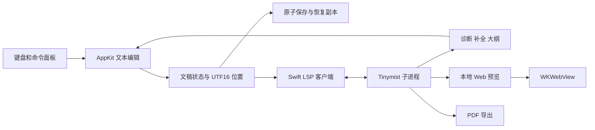

# Sumi 技术架构与交互规范

本文将产品需求落实为首版可执行的技术方案。技术选择以原生输入、可维护性、离线写作和复用 Tinymist 为优先，集成协议以固定版本的实际行为为准。

## 平台与工程

- Swift 6，macOS 14 起，仅支持 Apple Silicon。
- Swift Package Manager 管理 `SumiCore`、可导入的 `SumiApp` 库及极薄的 `SumiLauncher`，脚本生成 `.app` 包；测试直接导入生产应用代码。
- AppKit 管理窗口生命周期、菜单、文件对话框和文本视图；SwiftUI 构建布局、列表和命令面板。
- Tinymist 固定为 `v0.15.8`，使用上游发布的 macOS 二进制，下载时验证上游校验和，随构建产物打包。
- 运行时无需 Cargo、Homebrew 或独立 Typst 安装。初次使用外部 Typst 包可能需要联网下载，上游已缓存的包可离线复用。
- Phosphor 保留应用使用的少量图标资源，作为本地资源；保留上游许可证。

## 组件与数据流

### 文稿状态

首版只有一个活动编辑缓冲区。从主文稿的诊断或预览打开子文件时，保留主文稿作为编译入口，先向服务打开子文件缓冲区再打开主文件；手动打开或另存为重新确定入口。

每份文稿具有文件 URL、主文稿 URL、全文、单调递增版本、选区、保存基线和诊断列表。未命名文稿使用应用管理的草稿 URL，另存为后更新资源根目录与 LSP 文档标识。

编辑缓冲区记录单调版本，磁盘保存保留内容基线；请求结果按文稿版本、选区和服务会话过滤。编译状态由 Tinymist 通知驱动。诊断带版本时过滤过期版本；固定版本服务器的部分通知不带版本，快速输入时可能短暂显示上一轮诊断，不能宣称诊断与当前缓冲区严格同步。

保存采用原子写入。自动保存前校验磁盘是否仍与保存基线一致，发现冲突停止自动覆盖并提供重新加载和另存为操作。应用退出前刷新恢复副本；未保存用户内容不得只存在于视图中。

### 文本编辑

使用 `NSTextView` 和 `NSScrollView`，通过协调对象把最小编辑事件同步到文稿。正常输入不重建文本视图，不反复替换全文，不抢占 first responder。

文本和位置以 Foundation `NSString`/`NSRange` 的 UTF-16 单位处理，并与协商后的 LSP position encoding 一致。对中文、emoji、组合字符、CRLF 和文末位置做专门测试。

首次加载、外部重新加载或用户主动格式化才替换全文；高亮使用属性变更，不污染撤销记录。输入法 marked text 存在时延后高亮和补全应用。命令插入使用 `NSTextView.insertText(_:replacementRange:)` 的原生编辑路径，并将操作组成一次撤销。AppKit 撤销管理器可能在首次编辑时才创建，因此按编辑时机绑定撤销/重做完成通知，整组结束后校正文稿状态，避免界面恢复而内部内容未恢复。

`SourcePresentation` 返回原始 UTF-16 范围，保守排除代码、注释和数学区域，为标题、粗体、斜体与行内代码提供显示属性。活动段落恢复完整标记，其余标记缩小并透明；不使用替代文本，不改变保存和复制内容。该层可随时关闭，不替代 Typst 编译。缩进/注释由纯文本范围变换实现；格式化走真实 LSP 并校验版本、会话和编辑范围。

首版高亮属于编辑层的视觉辅助，不能作为编译结果或可靠语义解析器。Tinymist 的诊断与编译才是语言正确性的依据。

### 命令系统

命令数据包含稳定 ID、中文名称、英文关键词、分组、组内按键、帮助文字、参数定义与执行动作。分组和搜索使用同一份注册表，避免维护两套功能列表。

状态机为关闭、分组浏览、搜索、参数输入四种状态。顶层 `⌘J` 开关面板，组内字母选择命令，`/` 进入搜索，`Esc` 逐层退出。普通编辑时不拦截裸空格，也不覆盖中文输入法候选操作。

命令通过明确的文本变换生成 Typst。变换返回替换范围、替换文本和占位选区，不自行写磁盘或更新预览。参数值按 Typst 字符串规则转义，数字和枚举独立校验。常见插入必须通过真实 Typst 编译用例验证。

正文插入先向 Tinymist 查询选区两端上下文；数学辅助命令接受同一个数学区域，并省略外层 `$`，其他正文命令拒绝数学、代码、原始文本位置。布局由显式的 inline/block/preamble 元数据决定。文稿设置插入到文件开头连续 `#set` 规则之后；不重写复杂 `#show` 或函数作用域，后续源码规则仍可能覆盖设置。

0.2 命令组（97 个命令，74 个插入动作）：

| 组 | 键 | 示例 |
|---|---|---|
| 插入 | i | 标题、图片、表格、代码、公式、链接、脚注、引用 |
| 样式 | s | 加粗、斜体、强调、选区包裹 |
| 页面 | p | 纸张、页边距、字号、页码 |
| 数学 | m | 基本运算 b、公式结构 s、符号与字形 y |
| 布局 | l | 分栏、网格、对齐、容器、间距 |
| 文献与目录 | r | 书目、引文、目录 |
| 文件与代码 | c | 模块、变量、Universe、格式化、缩进、注释 |
| 视图 | v | 写作、并排、预览、大纲、诊断、字号 |
| 文件 | f | 新建、打开、保存、另存为、导出 PDF |

窗口按键在 `WritingWindow.sendEvent` 的原生 AppKit 分发路径处理，保持系统 responder chain；不使用全应用 NSEvent 监听器及 `MainActor.assumeIsolated`。文件对话框打开期间不拦截主窗口命令。

### 诊断日志

`ActionLog` 同步写入本地 JSONL，以锁保护句柄、序号和轮转。单文件约 1 MiB，保留当前文件及 3 个归档。每次启动有独立会话 ID；正常退出记录 session.end，意外退出前已写入的记录保留。日志记录功能操作和控制按键，普通输入只标记为 text，不存正文、剪贴板内容、搜索词或表单参数。写日志失败不会中断写作或保存。

### Universe 包发现

`UniverseCatalogStore` actor 从官方 `packages.typst.org/preview/index.json` 读取纯元数据，用数字语义版本选取各包最新版本；严格校验包名和版本后才生成固定版本导入。索引以 JSON 原子缓存，24 小时 TTL，离线保留最近有效数据，支持强制刷新。编译器最低版本高于内置 Typst 0.15.1 时显示提示并禁用导入。浏览不执行包代码；显式插入后由编译器自行获取依赖。网络和状态均可注入，测试使用固定索引，不依赖 Universe 在线可用性。

### Tinymist 集成

使用 Foundation `Process` 启动附带二进制，stdin/stdout 为 LSP JSON-RPC 通道，stderr 单独排空且不持久化文稿日志。必须实现 Content-Length 分帧、碎片和多帧读取、请求 ID 对应、初始化顺序、超时和进程退出清理。

初始化后发送 `initialized`、`textDocument/didOpen`，通过 `didChange` 同步编辑缓冲区，切换文件或重启服务时结束整个独立进程会话，随后重新打开当前文件。第一版允许全量文本同步，避免过早引入增量 diff 错误；较大文稿在测量后优化。发送短防抖并确保保存/导出前刷新最新版本。

语言服务至少接入 publishDiagnostics、completion、documentSymbol，首版未接入 hover 和定义定位。应用自身的参数化命令不假设 Tinymist 会提供现成菜单。

预览通过 Tinymist 的 workspace 命令启动，固定本地回环地址和随机端口。具体命令、返回字段、源位置同步和 preview 控制通道先用独立协议探针验证，不能依赖文档中未确认的字段。维护服务器预览实例与文稿生命周期的一致性。

Tinymist 崩溃后保留编辑缓冲区，显示服务重启入口；重启初始化后重发打开文稿。不要自动无限重试。日志不得包含用户完整文稿。

### 预览

使用 `WKWebView` 承载 Tinymist 自带 Web/SVG 前端。限定在本地预览导航，外部链接显式交给系统浏览器；页面不能获得任意原生调用能力。

布局包括单栏写作、可调整的并排、全宽预览。预览面板提供缩放与当前状态，生成结果和编辑正文共享主文件、资源根目录和字体配置。预览加载失败不遮盖编辑区。缩放通过调整 Tinymist 页面容器宽度并触发重排实现，百分比相对于面板适应宽度。

启动显式使用 `--partial-rendering=true`，按可见区域绘制。编译错误继续保留现有预览实例和成功页面，状态条提示内容滞后；首次编译失败没有可保留页面。深色阅读复用固定前端的 `invert-colors` 与 `normal-image` 样式类，通过观察类属性保证服务器消息不会覆盖用户选择。此能力只改变屏幕显示，不改变编译输入或 PDF 导出。集成测试在真正的 WKWebView 中验证页面保留、修正源码后的新页面、缩放与深色状态。

源码与预览的双向定位通过 `tinymist.scrollPreview` 和 LSP `window/showDocument` 实现；无需向网页暴露原生消息桥。点击位置按返回的实际文件与范围定位，涉及其他文件时先打开对应文稿。

### 导出

通过 Tinymist 导出当前主文稿，导出前同步最新编辑缓冲区，等待明确结果再复制到用户选定目标。编译失败不能复制旧 PDF 并显示成功。以文稿版本与导出请求配对，导出期间继续编辑时注明导出的版本。

## 视觉规范

工作名 Sumi，意向为墨色与安静的写作空间。采用深炭灰与暖白文字，低饱和金色用于主操作、焦点和少量标记，辅助代码色控制在少数几种。

| 元素 | 初始设计值 |
|---|---|
| 窗口背景 | `#171A1D` |
| 编辑区域 | `#1C1F23` |
| 面板背景 | `#22262B` |
| 边界 | `#343A41` |
| 正文 | `#E0E2E5` |
| 次要文字 | `#9DA6B2` |
| 强调 | `#D9B97C` |
| 成功 | `#A3BE8C` |
| 错误 | `#E29A9A` |

应用界面使用系统无衬线字体，标识、路径和按键提示使用等宽字体。正文初始采用 16 pt 等宽字体和系统 CJK fallback，允许调节。写作区域以舒适行宽居中，视口两侧保持较大边距。

顶部采用 `NSToolbar` 的 `unifiedCompact` 样式，系统红黄绿按钮、文件名和操作按钮处于同一行；正文不再绘制第二层应用标题栏。底部状态条约 30 pt，显示位置、字数与入口提示。命令面板从底部展开，固定位置便于形成肌肉记忆，使用文字层次和细线划分。搜索结果和参数面板最多占窗口高度约 45%，小窗口提供滚动。

Phosphor Regular 使用 16–18 pt，低饱和单色。避免混用多套应用操作图标。图标不替代关键动作文字。首版面板直接切换，不依赖动画传达状态。

## 测试与交付

功能测试以原生 `WritingWindow`、`ManuscriptTextView`、`Workspace`、`WKWebView` 和真实 Tinymist 为一条完整流程，验证发现命令、插入/撤销/重做、打开/修改、文件冲突与恢复、诊断、预览和导出。核心边界测试补充覆盖 UTF-16、LSP 分帧、参数和元数据校验。不访问数据库，不运行 Hurl 或容器。

测试开启 Swift 代码覆盖率，合并工具链生成的全部测试 bundle 的 profile。以 LCOV DA 记录按实际文件/行去重统计，避免 SwiftUI 泛型/闭包重复实例化使同一行被多次计入；所有 `Sources/Sumi` 和 `Sources/SumiCore` 文件均纳入，缺失文件直接失败，整体必须达到 80%。原始 LLVM JSON、LCOV、逐文件摘要与 HTML 一并保留，不以覆盖率替代行为断言。

实际应用通过 UI 操作验证命令路径、输入、撤销、保存重开、预览与导出；截取实际界面检查视觉质量。中文 IME 若自动化不能完整验证，验收记录明确标为待人工确认，不能宣称已通过。

构建脚本设置 SSD 临时目录，把依赖下载、构建输出和测试数据留在当前 SSD worktree。输出 `build/Sumi.app`，开发构建使用本机临时签名。正式发布仅支持 Apple Silicon，由 `scripts/release.sh` 在临时钥匙串导入 Developer ID 证书，依次签名 Tinymist helper 与应用、提交 Apple 公证、装订票据并通过 Gatekeeper 校验。发布任务只能使用 main 已包含的提交，版本标签必须匹配 Info.plist；凭据缺失或任一校验失败时不发布。凭据配置见 [签名说明](signing.md)。

GitHub Actions 使用 macOS 15 Apple Silicon runner，PR/main 执行测试与覆盖率门槛、Release 构建及签名验证，保存报告和 app ZIP。版本标签与 Info.plist 版本必须匹配，发布流程重跑测试后打包arm64 ZIP 与 SHA-256，并创建 GitHub Release；权限限定为各 job 所需的只读或发布写权限，Action 固定 commit，Tinymist 下载 SHA-256 固定在源码。本地与 CI 共享脚本，CI 使用 runner 临时目录。

## 已知工程风险

- Tinymist 预览协议包含扩展接口，需要版本固定和真实集成测试。
- AppKit 与 SwiftUI 的焦点和状态同步必须避免重复文本替换。
- 语法视觉处理不能破坏输入法、undo 或源位置映射。
- 多文件项目需要明确主文稿，当前编辑文件不一定是编译入口。
- 从源码读取外部包、图片和字体依赖真实文件环境；导出需与预览保持一致。

## 参考

- [Tinymist preview](https://myriad-dreamin.github.io/tinymist/feature/preview.html)
- [Tinymist repository](https://github.com/Myriad-Dreamin/tinymist)
- [NSTextView](https://developer.apple.com/documentation/appkit/nstextview)
- [WKWebView](https://developer.apple.com/documentation/webkit/wkwebview)
- [Nano Emacs](https://github.com/rougier/nano-emacs)
- [Phosphor source assets](https://github.com/phosphor-icons/core)
- [CotEditor package/app test workflow](https://github.com/coteditor/CotEditor/blob/main/.github/workflows/test.yml)
- [CodeEdit tests workflow](https://github.com/CodeEditApp/CodeEdit/blob/main/.github/workflows/tests.yml)
- [GitHub macOS hosted runners](https://docs.github.com/en/actions/reference/runners/github-hosted-runners)
