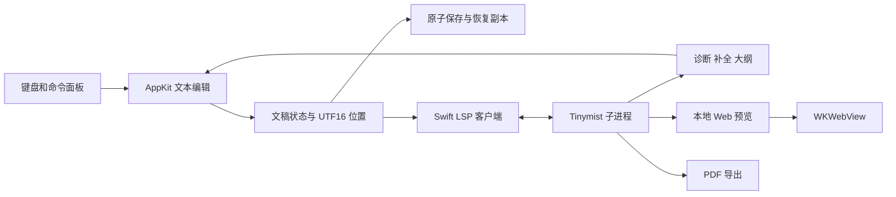

# Sumi 技术架构与交互规范

本文将产品需求落实为首版可执行的技术方案。技术选择以原生输入、可维护性、离线写作和复用 Tinymist 为优先，集成协议以固定版本的实际行为为准。

## 平台与工程

- Swift 6，macOS 14 起，首先面向 Apple Silicon。
- Swift Package Manager 管理应用和核心模块，脚本生成可运行的 `.app` 包；不强制依赖第三方工程生成器。
- AppKit 管理窗口生命周期、菜单、文件对话框和文本视图；SwiftUI 构建布局、列表和命令面板。
- Tinymist 固定为 `v0.15.8`，使用上游发布的 macOS 二进制，下载时验证上游校验和，随构建产物打包。
- 运行时无需 Cargo、Homebrew 或独立 Typst 安装。初次使用外部 Typst 包可能需要联网下载，上游已缓存的包可离线复用。
- Phosphor 保留应用使用的少量图标资源，作为本地资源；保留上游许可证。

## 组件与数据流

### 文稿状态

首版只有一个活动编辑缓冲区。从主文稿的诊断或预览打开子文件时，保留主文稿作为编译入口，先向服务打开子文件缓冲区再打开主文件；手动打开或另存为重新确定入口。

每份文稿具有文件 URL、主文稿 URL、全文、单调递增版本、选区、保存基线和诊断列表。未命名文稿使用应用管理的草稿 URL，另存为后更新资源根目录与 LSP 文档标识。

编辑缓冲区记录单调版本，磁盘保存保留内容基线；请求结果按文稿版本、选区和服务会话过滤。编译状态由 Tinymist 通知驱动。诊断带版本时过滤过期版本；固定版本服务器的部分通知不带版本，快速输入时可能短暂显示上一轮诊断，不能宣称诊断与当前缓冲区严格同步。

保存采用原子写入。自动保存前校验磁盘是否仍与保存基线一致，发现冲突停止自动覆盖并提供重新加载和另存为操作。应用退出前刷新恢复副本；未保存用户内容不得只存在于视图中。

### 文本编辑

使用 `NSTextView` 和 `NSScrollView`，通过协调对象把最小编辑事件同步到文稿。正常输入不重建文本视图，不反复替换全文，不抢占 first responder。

文本和位置以 Foundation `NSString`/`NSRange` 的 UTF-16 单位处理，并与协商后的 LSP position encoding 一致。对中文、emoji、组合字符、CRLF 和文末位置做专门测试。

首次加载或外部重新加载才替换全文；高亮使用属性变更，不污染撤销记录。输入法 marked text 存在时延后高亮和补全应用。命令插入经过 `shouldChangeText`、undo manager 和 `didChangeText`，保持系统撤销体验。

首版高亮属于编辑层的视觉辅助，不能作为编译结果或可靠语义解析器。Tinymist 的诊断与编译才是语言正确性的依据。

### 命令系统

命令数据包含稳定 ID、中文名称、英文关键词、分组、组内按键、帮助文字、参数定义与执行动作。分组和搜索使用同一份注册表，避免维护两套功能列表。

状态机为关闭、分组浏览、搜索、参数输入四种状态。顶层 `⌘J` 开关面板，组内字母选择命令，`/` 进入搜索，`Esc` 逐层退出。普通编辑时不拦截裸空格，也不覆盖中文输入法候选操作。

命令通过明确的文本变换生成 Typst。变换返回替换范围、替换文本和占位选区，不自行写磁盘或更新预览。参数值按 Typst 字符串规则转义，数字和枚举独立校验。常见插入必须通过真实 Typst 编译用例验证。

正文插入先向 Tinymist 查询选区两端上下文，拒绝数学、代码、原始文本等不安全位置。页面设置命令插入到文件开头连续 `#set` 规则之后；不重写复杂 `#show` 或函数作用域，后续源码规则仍可能覆盖设置。

第一版命令组：

| 组 | 键 | 示例 |
|---|---|---|
| 插入 | i | 标题、图片、表格、代码、公式、链接、脚注、引用 |
| 样式 | s | 加粗、斜体、强调、选区包裹 |
| 页面 | p | 纸张、页边距、字号、页码 |
| 视图 | v | 写作、并排、预览、大纲、诊断、字号 |
| 文件 | f | 新建、打开、保存、另存为、导出 PDF |

### Tinymist 集成

使用 Foundation `Process` 启动附带二进制，stdin/stdout 为 LSP JSON-RPC 通道，stderr 单独排空且不持久化文稿日志。必须实现 Content-Length 分帧、碎片和多帧读取、请求 ID 对应、初始化顺序、超时和进程退出清理。

初始化后发送 `initialized`、`textDocument/didOpen`，通过 `didChange` 同步编辑缓冲区，切换文件或重启服务时结束整个独立进程会话，随后重新打开当前文件。第一版允许全量文本同步，避免过早引入增量 diff 错误；较大文稿在测量后优化。发送短防抖并确保保存/导出前刷新最新版本。

语言服务至少接入 publishDiagnostics、completion、documentSymbol，首版未接入 hover 和定义定位。应用自身的参数化命令不假设 Tinymist 会提供现成菜单。

预览通过 Tinymist 的 workspace 命令启动，固定本地回环地址和随机端口。具体命令、返回字段、源位置同步和 preview 控制通道先用独立协议探针验证，不能依赖文档中未确认的字段。维护服务器预览实例与文稿生命周期的一致性。

Tinymist 崩溃后保留编辑缓冲区，显示服务重启入口；重启初始化后重发打开文稿。不要自动无限重试。日志不得包含用户完整文稿。

### 预览

使用 `WKWebView` 承载 Tinymist 自带 Web/SVG 前端。限定在本地预览导航，外部链接显式交给系统浏览器；页面不能获得任意原生调用能力。

布局包括单栏写作、可调整的并排、全宽预览。预览面板提供缩放与当前状态，生成结果和编辑正文共享主文件、资源根目录和字体配置。预览加载失败不遮盖编辑区。缩放通过调整 Tinymist 页面容器宽度并触发重排实现，百分比相对于面板适应宽度。

源码与预览的双向定位通过 `tinymist.scrollPreview` 和 LSP `window/showDocument` 实现；无需向网页暴露原生消息桥。点击位置按返回的实际文件与范围定位，涉及其他文件时先打开对应文稿。

### 导出

通过 Tinymist 导出当前主文稿，导出前同步最新编辑缓冲区，等待明确结果再复制到用户选定目标。编译失败不能复制旧 PDF 并显示成功。以文稿版本与导出请求配对，导出期间继续编辑时注明导出的版本。

## 视觉规范

工作名 Sumi，意向为墨色与安静的写作空间。采用深炭灰与暖白文字，低饱和金色用于主操作、焦点和少量标记，辅助代码色控制在少数几种。

| 元素 | 初始设计值 |
|---|---|
| 窗口背景 | `#171A1D` |
| 编辑区域 | `#1C1F23` |
| 面板背景 | `#22262B` |
| 边界 | `#343A41` |
| 正文 | `#E0E2E5` |
| 次要文字 | `#9DA6B2` |
| 强调 | `#D9B97C` |
| 成功 | `#A3BE8C` |
| 错误 | `#E29A9A` |

应用界面使用系统无衬线字体，标识、路径和按键提示使用等宽字体。正文初始采用 16 pt 等宽字体和系统 CJK fallback，允许调节。写作区域以舒适行宽居中，视口两侧保持较大边距。

顶部内容区约 54 pt，容纳交通灯、文件名、保存状态和有限操作。底部状态条约 30 pt，显示位置、字数与入口提示。命令面板从底部展开，固定位置便于形成肌肉记忆，使用文字层次和细线划分。搜索结果和参数面板最多占窗口高度约 45%，小窗口提供滚动。

Phosphor Regular 使用 16–18 pt，低饱和单色。避免混用多套应用操作图标。图标不替代关键动作文字。首版面板直接切换，不依赖动画传达状态。

## 测试与交付

核心测试覆盖 UTF-16 位置、LSP 分帧、命令变换、字符串转义、保存冲突与草稿恢复。集成测试启动真实 Tinymist，验证打开/修改、诊断、预览和导出，不访问数据库，不运行 Hurl 或容器。

实际应用通过 UI 操作验证命令路径、输入、撤销、保存重开、预览与导出；截取实际界面检查视觉质量。中文 IME 若自动化不能完整验证，验收记录明确标为待人工确认，不能宣称已通过。

构建脚本设置 SSD 临时目录，把依赖下载、构建输出和测试数据留在当前 SSD worktree。输出 `build/Sumi.app`，使用本机临时签名便于启动；公开分发所需 Developer ID、公证及 App Store 策略不属于首版完成要求。

## 已知工程风险

- Tinymist 预览协议包含扩展接口，需要版本固定和真实集成测试。
- AppKit 与 SwiftUI 的焦点和状态同步必须避免重复文本替换。
- 语法视觉处理不能破坏输入法、undo 或源位置映射。
- 多文件项目需要明确主文稿，当前编辑文件不一定是编译入口。
- 从源码读取外部包、图片和字体依赖真实文件环境；导出需与预览保持一致。

## 参考

- [Tinymist preview](https://myriad-dreamin.github.io/tinymist/feature/preview.html)
- [Tinymist repository](https://github.com/Myriad-Dreamin/tinymist)
- [NSTextView](https://developer.apple.com/documentation/appkit/nstextview)
- [WKWebView](https://developer.apple.com/documentation/webkit/wkwebview)
- [Nano Emacs](https://github.com/rougier/nano-emacs)
- [Phosphor source assets](https://github.com/phosphor-icons/core)
