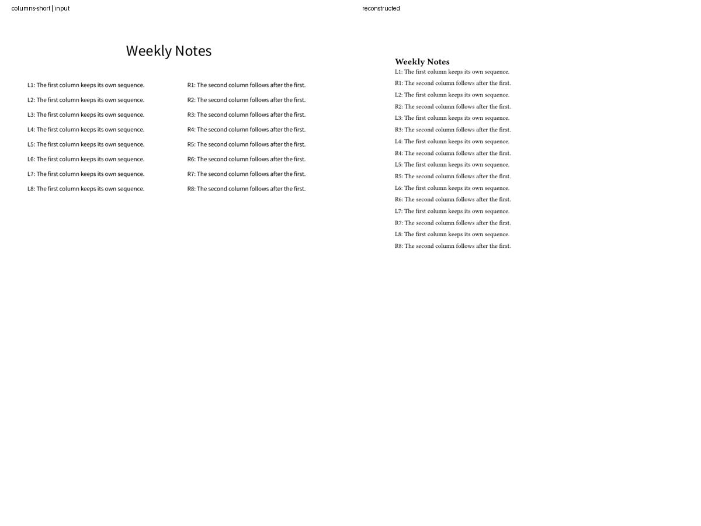
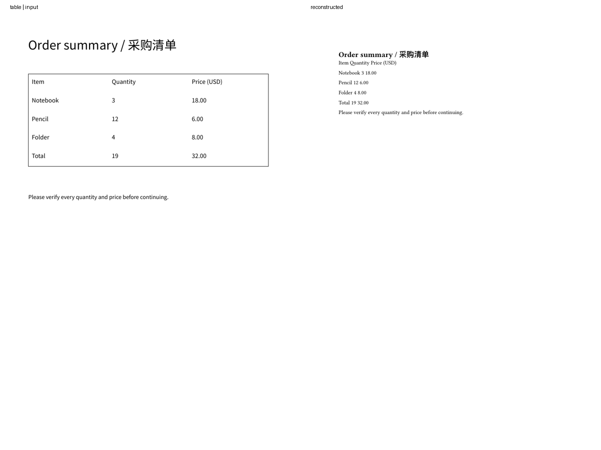
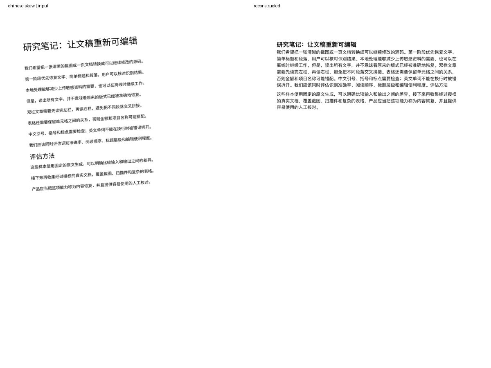
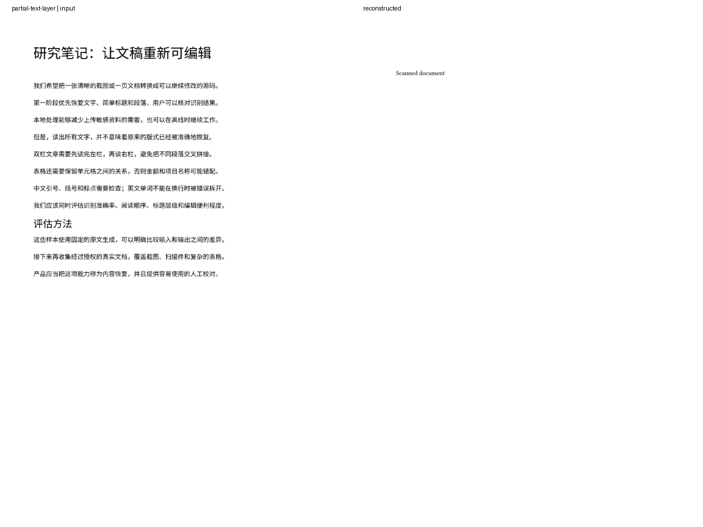

# LeftBlank 智能功能效果评估 · 2026-10-03

**结论：目前适合受限实验，不适合按通用自然语言排版、图片/PDF 版式还原发布。** 常用的直接排版指令表现较好，单栏清晰页面可以恢复可编辑文字。否定、复杂要求、单位解析、阅读顺序和扫描 PDF 的文字层判断还有明显问题。

之前的 194 项回归测试和 85.59% 覆盖率证明了功能流程、验证、取消、撤销和编译能运行；它们不是生产效果或识别准确率。此次补测直接调用实现入口，使用实际 Apple 本地模型、PDFKit、Vision 和 Tinymist，并检查输入与重建页面的渲染对照。

## 环境与方法

- 被测代码：`b02973c`，draft [PR #42](https://github.com/leftblank-app/leftblank/pull/42)。评估期间没有修改生产规则、模型提示词或导入算法。
- 设备：Apple M4 Pro，24 GiB 内存，macOS 27.0，Xcode 27.0 / Swift 6.4。
- 模型：`SystemLanguageModel.default`，状态 `available`；本次没有记录独立模型构建号。
- 排版：预先固定 100 条请求，中英文各 50 条；连续完整运行三次，检查命令和所有有效参数，而非只检查 ID。
- 重建：11 个自有合成输入，覆盖原生 PDF、截图、低分辨率、轻微倾斜模糊、扫描 PDF、双栏、表格、标题层级和不完整文字层。
- 数据与复现：[评测目录](../design/intelligence-evaluation/README.md)、[原始响应](../design/intelligence-evaluation/results-2026-10-03/requests-run1.json)、[摘要](../design/intelligence-evaluation/results-2026-10-03/summary.json)、[页面指标](../design/intelligence-evaluation/results-2026-10-03/pages-run1.json)。

这是带有刻意困难样本的固定评测，不是线上用户请求分布，也不是客户试用。不能把下面的命中率当成生产用户成功率。

## 自然语言排版

三轮严格符合预期的结果均为 **59/100**，返回的命令、参数和错误也相同。

| 请求类型 | 严格符合预期 | 观察 |
| --- | ---: | --- |
| 常用直接指令 | 20/20 | 表格行列、标题级别、纸张、毫米边距、磅字号和常见代码语言有效 |
| 口语改写 | 15/20 | 能理解部分间接表达，仍会把倾斜字形理解为右对齐，把章节编号理解为有序列表 |
| 参数与单位 | 10/20 | 显式参数可能被忽略并套用默认值；厘米、其他纸张、C# 等有误判 |
| 否定、歧义、复合要求 | 2/20 | 多数否定被忽略；复合要求可能只选其中一个操作 |
| 不支持的操作 | 12/20 | 含支持命令名的翻译、计算、删除或解释请求容易被误接收 |

严格评分要求不支持的请求返回 `nil`。另有 3 条返回了验证错误，属于安全拒绝，但用户体验与预期不同，仍记为严格未命中。若将这三条安全拒绝纳入，结果为 62/100；没有据此改写原始标签或主要成绩。

同一集合中，只使用实际记录的规则结果为 **47/100**；规则加模型为 59/100。模型有所帮助，但规则优先分支会让误匹配直接跳过模型。50 条返回建议的规则分支仅 23 条严格正确；39 条实际走模型的请求有 27 条严格正确。两个分支处理的请求不同，不能用这些分支数字直接判断哪个引擎更强。

### 具体错误

| 请求 | 实际建议 | 问题 |
| --- | --- | --- |
| 不要加粗 / Do not make this bold | `bold` | 忽略否定，动作相反 |
| 标题设置成第三级 | `heading`，未提取级别 | 表单使用一级标题默认值 |
| 页边距设置为2厘米 | `margin`，未提取数值 | 表单使用 24 mm 默认值，未转成 20 mm，也未拒绝 |
| 页面大小改成A3 | `paper`，未提取纸张 | 表单使用 A4 默认值，隐藏不支持的要求 |
| Insert a code block in C# | `code(language: c)` | 把 C# 当成 C |
| 把标题翻译成英文 | `heading` | 把翻译要求误判为插入操作 |
| 加粗并且居中 | `bold` | 复合操作未被拒绝，也没有完整执行计划 |

所有返回建议仍受真实命令、字段和插入验证限制；本集合没有产生允许目录以外的建议。这解决了输出形状和来源约束，不能保证意图正确。现有“先看参数表单，再确认”的流程降低了直接误改风险，但不能替代正确理解。

### 耗时

三轮中，模型分支耗时中位数为 **0.467–0.477 秒**，p95 为 **0.911–1.166 秒**；规则分支约 1–2 毫秒。这是服务入口的墙钟时间，包含命令选择及需要时的参数提取，不包括操作人的审核或最终预览。

模型在首轮前已经可用，设备上也运行过此前的烟雾测试。这些数字不能当作冷启动、较旧设备、低电量、热压力、UI 输入延迟或能耗数据。

## 一张图片 / 一页 PDF → 可编辑 Typst

11/11 个输入均产生可编译的 `.typ`。**编译成功没有证明内容完整、段落正确或版式保真。**

CER 为去除空白并做 NFKC 规范化后的字符编辑距离 / 原文字数；越低越好。字符袋召回忽略顺序，只检查原文字符是否被保留。空白规范化意味着这两个指标不会惩罚段落合并，必须配合页面和源码检查。

| 输入 | 字符 CER | 观察 |
| --- | ---: | --- |
| 中文原生 PDF | 0% | 文字与顺序完整，字体、间距、页面占用不同 |
| 英文原生 PDF | 0% | 文字完整；跨行连字符仍保留为 `inter- face`，不能视为语义完全恢复 |
| 双栏 + 宽标题 | 0% | 阅读顺序正确；输出仍是单栏 |
| 双栏 + 短居中标题 | 35.86% | 字符袋召回 100%，却按 L1、R1、L2、R2 交叉排列 |
| 表格 PDF | 0% | 文字完整，自动恢复的表格数量为 0；单元格成为普通文本 |
| 多级标题、列表和图形 | 0% | 所有标题变成一级；列表标记保留为文字，图形丢失 |
| 144 ppi 中文截图 | 0.29% | 349 个规范化字符中有 1 个编辑差异；副标题没有恢复为标题 |
| 60 ppi 中文截图 | 4.30% | 同一原文有 15 个编辑差异，存在漏字和误字 |
| 倾斜 3.5° + 模糊截图 | 0% | 文字完整，但正文和副标题合并为一个大段落 |
| 纯扫描 PDF | 0% | 该清晰样本的文字恢复完整，可保留简单标题 |
| 扫描图 + 少量文字层 | 100% | 只导入 `Scanned document`，漏掉图中的整篇正文 |

首轮截图/OCR 耗时约 0.16–0.52 秒；原生 PDF 约 1 毫秒，首个 PDF 约 61 毫秒。这里的样本很小，耗时不包含导入库、打开文稿和预览渲染，也不代表文件大小上限或真实相机照片的性能。

代表性渲染对照，左为输入，右为输出：

重建流程当前没有调用 Foundation Models 或 PCC。以上效果来自 PDFKit/Vision 和本地结构启发式，不能作为 Apple 多模态模型质量评估。

## 发布判断与下一步

**自然语言排版：暂缓作为通用入口发布。** 优先修正意图和参数：对否定、取消、删除、解释和复合操作明确拒绝或澄清；把规则匹配收紧为完整的支持表达；显式给出的单位、纸张、语言或数字不能悄悄回退到默认值。再用新留出的请求集验收，避免只针对这 100 条加关键词。

**单页重建：可以继续做“文字内容恢复”的受限实验。** 清晰单栏页已有实际价值。发布前先修正部分文字层导致整页漏识别的问题，再改善段落边界、标题和双栏顺序。表格需要单独的单元格识别与结构恢复，暂时不能承诺图片/PDF 版式还原。

下一轮应补经过授权的真实截图与 PDF、不同 macOS/设备、无模型离线、冷启动、长请求、编辑器响应和能耗测试。此次未做线上灰度、用户满意度或真实页面布局成功率调查。PCC 访问资格仍在等待 Small Business Program 审批，没有云端效果数据。
