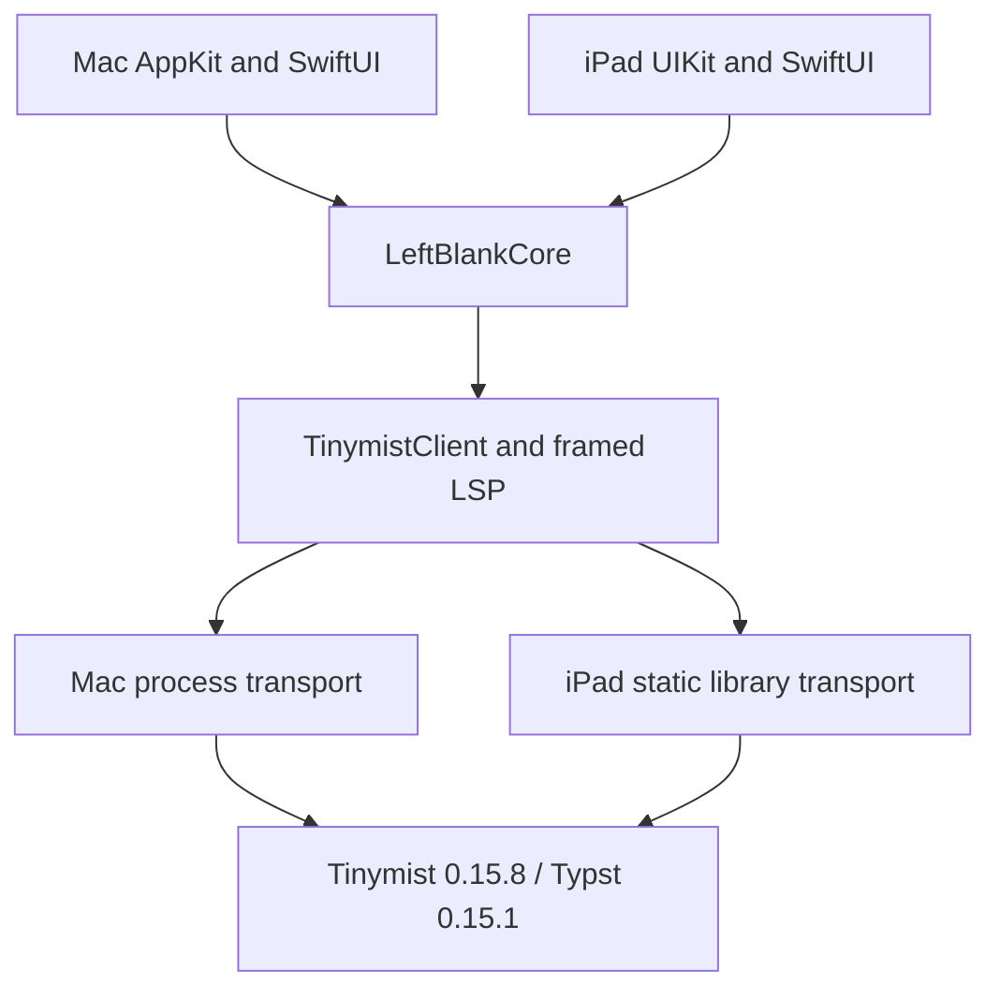

# Mac and iPad architecture and parity

## Shared core, native presentation

The goal is the same document behavior and design language on both platforms.
Keep business rules in `LeftBlankCore`; keep AppKit/UIKit views, native editor
integration, lifecycle and engine startup in their platform targets. Native
layout adapts to window size and input methods. Templates and packages do not
need separate discovery, installation or caching implementations for iPad.

| Layer | Shared implementation | Platform responsibility |
| --- | --- | --- |
| Documents | `DocumentLibrary`, conflict-aware saves, recovery and history | File pickers, library navigation, background save |
| Editing | Commands, insertion plans, syntax presentation, `DocumentMetrics`, UTF-16 positions | `NSTextView` / `UITextView`, selection, IME, undo and focus |
| Templates and packages | `UniverseBrowserModel`, catalog/discovery, template installer, bounded thumbnail download/cache | Gallery layout and NSImage / UIImage decoding |
| Typesetting | `TinymistClient`, framed LSP, diagnostics, formatting, PDF export | `ProcessTinymistTransport` / `EmbeddedTinymist` |
| Preview | Tinymist frontend, `PreviewScripts`, source-location decoding | Native WebKit host, sizing and editor reveal |
| Design | Phosphor PDF icons, localized copy, syntax palette | Platform colors, toolbar and touch targets |

This follows Apple's support for [sharing code across platform targets](https://developer.apple.com/documentation/Xcode/configuring-a-multiplatform-app-target).
It is an architectural choice, not a claim that Apple requires this exact split.
The platform workspaces still contain presentation orchestration; future features
should extend shared services rather than copy business rules into both workspaces.

## Why Mac still runs an engine process

iPad embeds Tinymist as a Rust static library. Its background worker and pipes
carry the same LSP messages as Mac, without replacing application stdin/stdout or
changing the app's working directory. Mac packages and starts a Tinymist helper
executable. Both use the same engine generation and shared Swift client.

Embedding does not remove the Typst compiler or intentionally restrict its
typesetting features. It also does not establish equal speed, memory use or
recovery behavior. The iPad bridge currently uses two Tokio workers and a
size-optimized release build; there is no controlled comparison with Mac's
upstream executable. Platform fonts can also change pagination.

Keep Mac's process boundary for now: an engine crash can terminate the helper
without terminating the editor, and its memory has a separate lifetime. Apple's
[XPC guidance](https://developer.apple.com/library/archive/documentation/MacOSX/Conceptual/BPSystemStartup/Chapters/CreatingXPCServices.html)
describes process isolation as a stability technique; our current helper uses
`Process`, not XPC. An embedded engine shares the app's failure and memory domain.
The Rust bridge catches unwinding panics at its entry point, but that does not
isolate an abort or a fatal worker failure.

Before changing Mac's transport, compare both transports on the same Mac, engine
revision, fonts, documents and release settings. Measure cold and warm startup,
first preview, edit-to-preview p50/p95, PDF export, combined app/engine/WebKit peak
memory, repeated document switches and failure recovery. Then run representative
books on iPad and test background suspension. Use the same output checks in both
cases. Apple's [performance workflow](https://developer.apple.com/documentation/xcode/improving-your-app-s-performance/)
supports measurement before optimization. Small-document correctness tests are
not a substitute for these measurements.

## Independent builds and releases

| Platform | Build and validation | Distribution |
| --- | --- | --- |
| Mac | SwiftPM, `scripts/test.sh`, existing Mac CI and book benchmarks | Existing signed preview and Mac release workflows |
| iPad | Xcode target, `scripts/build-ipad.sh`, `.github/workflows/ipad.yml` | Development installation works; TestFlight/App Store automation is not configured |

The iPad workflow runs engine integration, simulator build/UI tests, and device
build in parallel jobs with independent engine caches. Mac CI still validates
shared code and the Mac app. Shared changes trigger both workflows. CI device
builds are unsigned; simulator tests do not establish physical-device performance.

The current main-branch ruleset requires `build and test` and 80% coverage, but
does not yet require the new `iPad engine`, `iPad simulator` and `iPad device`
checks. Add those checks to repository merge requirements before treating iPad
validation as an enforced release gate. This PR does not change repository rules.

Existing Mac release tags do not publish an iPad build. Apple supports adding an
[iOS platform to the same app record](https://developer.apple.com/help/app-store-connect/create-an-app-record/add-platforms)
with the same bundle identifier and independently selected platform versions and
builds. The iPad app uses the Mac App Store bundle identifier and iCloud container.
Before distribution, configure the iOS app record, distribution provisioning and
archive/export/upload pipeline, and replace the initial fixed `1.0` / `1` version
values with release inputs. Development signing does not validate that pipeline.

## Current parity and release gaps

| Area | Current iPad behavior | Remaining work or evidence |
| --- | --- | --- |
| Local typesetting and PDF | Live preview and native PDF sharing; fallback/system fonts supplied | Matching fonts/assets required for equal pagination; large-book performance unmeasured |
| Preview to source | A preview tap reveals the main `.typ` file's UTF-16 source position; split view stays split | Included-file editing/navigation is missing and reports that limitation |
| Source to preview | Live updates and outline-to-editor navigation | Explicit caret-to-preview reveal is missing |
| Templates/packages | Shared bilingual search, categories, offline catalog, downloads and installation; native gallery/details | Physical community-template creation and broad package compatibility need verification |
| Editor assistance | Syntax styling, checks, outline, command insertion, formatting, native undo/find | Completion, signature-help and hover UI are missing |
| Projects | Built-in/community templates and folder import | Folder import expects `main.typ`; only the entry file can be edited |
| History and recovery | Shared snapshots, version restore and conflict-aware saves | Mac's full history diff UI is missing; background/relaunch recovery needs stress testing |
| Native workflows | Adaptive writing/preview/split, rotation, touch controls and common shortcuts | Multiwindow, complete keyboard-menu parity, printing and project export are missing |
| Agents | Shared protocol code can build for iPad | Mac agent/MCP workflow has not been ported |
| Input/accessibility | Native UIKit editor with composition safeguards | Chinese IME, hardware keyboard/trackpad, VoiceOver and Dynamic Type need manual verification |
| Cloud/lifecycle | Shared iCloud library services and background save hook | Cross-device conflicts, suspension/resume and memory-pressure behavior need device testing |

This PR establishes the native iPad app and shared boundaries. It is not complete
Mac feature parity or a distribution-ready release. Record physical test evidence
in [ipad.md](ipad.md); keep unmeasured performance and missing features explicit.
