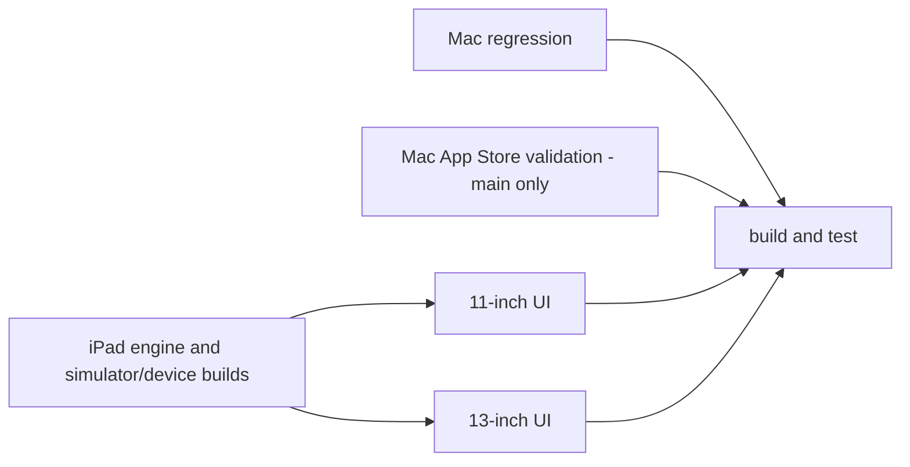

# iPad development

The native iPad target requires iPadOS 17 or later and Xcode 26.3 or later. Open
`iPad/LeftBlank.xcodeproj` and use the **LeftBlank-iPad** scheme. Set the signing
team before installing on a physical iPad; the app uses the same bundle identifier
and iCloud document container as the Mac App Store target.

## Shared behavior

The app shares document storage, conflict-aware saves, recovery snapshots,
revision history, built-in templates, command insertion, package discovery, SICP
import, Typst diagnostics, formatting, and PDF export with the Mac implementation.
Tinymist 0.15.8 / Typst 0.15.1 is pinned to the same engine generation as Mac.

On iPad, Tinymist runs as a Rust static library on a background worker, with the
same framed LSP and local WebKit preview. It does not launch an executable. Pipes
connect the Swift client to the engine without replacing application stdin/stdout
or changing its working directory. Each document connection owns its worker and
runtime. Closing the client delivers EOF and shuts down that worker. CoreText
font URLs are copied into an application cache and explicitly included in LSP
initialization, so package-cache options cannot replace the font search path.
Typst's default fonts are also embedded as a fallback. Identical pagination still requires the same fonts and assets on both
platforms; platform system font sets may differ.

The shared core also bundles Noto Sans SC as a portable Chinese fallback.
On the physical iPad, `PingFangUI.ttc` contains Apple-specific `cidg` / `hvgl`
glyph tables without standard TrueType/CFF outlines, so Typst cannot use it.
The welcome template retains Libertinus Serif and PingFang SC first, with Noto
last. Existing Mac typography and app interface fonts remain unchanged; iPad
Chinese text can use Noto offline. An unavailable explicitly named system font
can still produce a warning. Older manuscripts retain their font declarations.
The welcome document now copies its relative SVG asset during both first launch
and template creation. Opening an older LeftBlank starter repairs a missing mark
without replacing an existing asset or rewriting the manuscript.

The UIKit editor preserves native selection, IME composition, undo, find,
keyboard and trackpad behavior. Wide detail panes offer writing and preview side
by side; narrow multitasking windows and portrait layouts switch between them.
The library uses native navigation, menus, document pickers, sheets and sharing.
Keyboard shortcuts include save, command discovery, outline and PDF export.

The library header keeps its title on a separate line and uses the shared
Phosphor assets for search, discovery, library actions and the sidebar toggle.
Built-in documents and the SICP sample book live inside template discovery.
Search hints follow the template/package mode, and category icons come from the
shared Mac/iPad definitions. Native menu labels use image values so their action
titles remain available to accessibility.

On iPadOS 18 and later, discovery presentation sizing follows the actual app
window, capped at 1120 points wide and 1100 points high. iPadOS 17 uses a full-screen
presentation. Gallery columns adapt to the available width. At 1000 points or
wider, selecting a template or package opens a 360-point detail pane beside the
catalog; narrower windows show detail with a back-to-results action. Selection
and search survive rotation across this breakpoint. The action bar stays visible
below the scrollable detail content.

## Build and validation

Run from an SSD-backed worktree under `/Volumes/SSD/Developer`:

```sh
scripts/test-ipad-engine.sh
scripts/build-ipad.sh simulator
scripts/build-ipad.sh device
scripts/lint.sh
```

These scripts install Rust 1.92.0 and keep dependency sources and targets on the
external development volume. Cargo.lock includes upstream's Typst and preview
patches; do not replace them with unpatched crates.io releases. The app builds
link the static engine for the selected SDK. Builds are unsigned by default.

The engine integration probe runs the C bridge in a native host executable. It
checks initialization, Unicode edits, outline updates, live preview HTTP, PDF
export from an unsaved buffer (including actual text drawing commands), and
orderly shutdown. It establishes engine and
transport behavior, but does not replace iPad runtime testing.

The UI test target checks editing, autosave, preview switching, rotation, command
insertion, preview-to-source navigation, template discovery, package import and
PDF sharing, plus English and Chinese welcome rendering. Run it with an available
iPad simulator:

```sh
xcodebuild -project iPad/LeftBlank.xcodeproj -scheme LeftBlank-iPad \
  -destination 'platform=iOS Simulator,id=<iPad simulator UUID>' \
  -derivedDataPath build/iPad -clonedSourcePackagesDirPath .build/xcode-packages \
  CODE_SIGNING_ALLOWED=NO test
```

Mac and iPad share one `.github/workflows/ci.yml` workflow. Mac regression and
Mac App Store validation (main only) run alongside the iPad engine/simulator/device
build matrix. After those iPad prerequisites pass, two UI jobs run the full suite on
11-inch and 13-inch devices on separate standard macOS runners. The existing
`build and test` check aggregates Mac and iPad results and rejects failed,
cancelled or unexpectedly skipped prerequisites. PRs expect the main-only
App Store check to be skipped; main requires it to pass. Mac regression tests remain in
`scripts/test.sh`. Platform build/release boundaries, engine
tradeoffs and the feature-gap inventory are in [ipad-architecture.md](ipad-architecture.md).



Successful compilation is cached before UI testing, so a failed UI test does not
discard the Rust build. Cache uploads are bounded and optional. The simulator
build produces an `.xctestrun` bundle once. Its Products directory is transferred
in a compressed tar archive, preserving executable permissions and symlinks.
The intermediate artifact is retained for one day. Both UI runners consume this
same build without resolving or rebuilding packages. Each invocation of
`scripts/ipad_simulator.py --size <11-inch|13-inch>` selects and boots only its
requested size on the newest available iOS runtime, then shuts it down after
testing. The two sizes cannot compete for resources on the same machine.
Boot readiness is limited to four minutes, UI execution to twelve minutes per
device, and shutdown to one minute. Each UI step is limited to 19 minutes and
its job to 30 minutes, including artifact transfer and result upload.
Boot monitoring prints migration progress. Failures include bounded device,
memory and process diagnostics; test results are saved separately for each size.
Shutdown failure fails that job. Timeouts kill the command's process group before
cleanup. Offline lifecycle contracts run in the engine job.
Tests retain 150/180-second default/maximum per-test allowances, stop at their
first failure, and terminate the app after each case.

## Current evidence and remaining work

On October 2, 2026, the complete Mac regression suite passed with 85.88% coverage
after the shared font and discovery changes. A focused Tinymist round trip also
verified that the bundled Noto family is recognized and exports Chinese text. The embedded-engine integration passed, and both
simulator and device builds succeeded. The earlier four-test suite passed on a
physical iPad Air 13-inch (M4), iPadOS 26.6.1, in 119 seconds. It verified
full-selection replacement, autosave, live preview, rotation, command insertion,
undo/redo, preview-to-source navigation, template discovery, package import and
the native PDF sharing sheet. Earlier runs also verified blank-page preview.
The final six-test suite passed in 194 seconds on the same physical iPad. It also
verified English and Chinese welcome rendering, absence of compilation errors,
welcome PDF sharing, native menu accessibility, full library title, mode-specific
search hints, removal of the system sidebar button in collapsed/expanded states,
and catalog/detail selection retained across portrait/landscape rotation.
Screenshots were inspected for glyphs and the final layout. The welcome PDF is a
two-page A4 document with embedded font mappings and text drawing commands.
Simulator and signed device test builds passed. UI tests use local storage with
iCloud disabled. No local 10.9-inch runtime result is claimed; SSD simulator
creation failed. GitHub run 37011166516 passed engine and device compilation but
timed out during concurrent 11/13-inch simulator boot, before UI tests started.
After requesting the second boot, `simctl boot` took almost three minutes; even
artifact and cleanup commands slowed down. Resource contention is the likely
cause, though that run did not collect memory diagnostics. The workflow now
isolates the two sizes on separate runners. Seven offline lifecycle contracts
passed, and a real compiled Products archive was relocated and verified for
`.xctestrun` paths, executable permissions, binary checksums and the bundled font.
The unified parallel CI still needs hosted-runner verification.

The shared catalog/gallery refactor and source-navigation callback also passed
simulator and device compilation, including the expanded UI test target. GitHub
CI's iOS 18.5 simulator passed preview-to-source navigation and command/PDF tests.
It exposed selection instability after switching layouts and typographic quotes
in programmatic package insertion. The editor now avoids changing typing
attributes on selection-only updates and inserts code verbatim through text
storage, with undo/redo registration. The package test waits for visible inserted
source and checks preservation around the preamble insertion point. The expanded
physical suite passed with these fixes. GitHub run 37004640328 subsequently
passed all four tests on an iOS 26.2 13-inch simulator; its boot completed in
about 83 seconds. The later six-test suite still needs the revised CI run.

The initial blank preview was traced to missing fallback fonts and initialization
options replacing the CoreText font directory. Both are corrected. iPad now uses
the Mac Phosphor resources and syntax palette, with compact titles, rows and view
controls. Preview chrome and WebKit rendering setup are shared with Mac.

The local simulator could not be created on the external SSD: CoreSimulator
reported Cocoa error 513 and POSIX `Operation not permitted`. No internal-disk
simulator fallback was used; runtime evidence comes from the physical iPad.

Before shipping, manually verify Chinese IMEs, VoiceOver, Dynamic Type,
keyboard/trackpad editing, large books, background/relaunch recovery, preview
after suspension, and iCloud synchronization with a Mac. Compare PDF pagination
using matching fonts. Signed installation and UI tests do not establish all of
these behaviors.

The current project importer expects `main.typ` in the chosen folder. The iPad
editor exposes one active entry file; Mac's included-file navigation, agent/MCP
integration, multiwindow workflows and full completion UI are not yet ported.
This is the initial iPad implementation, not a claim of complete feature parity.
