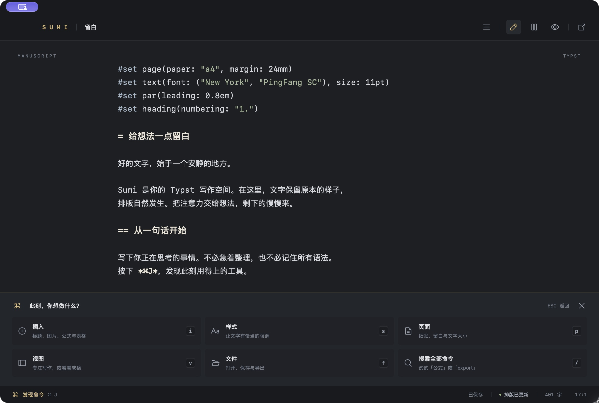
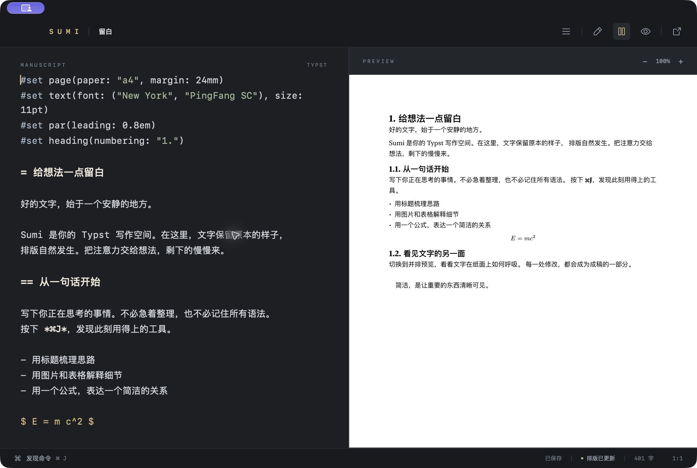
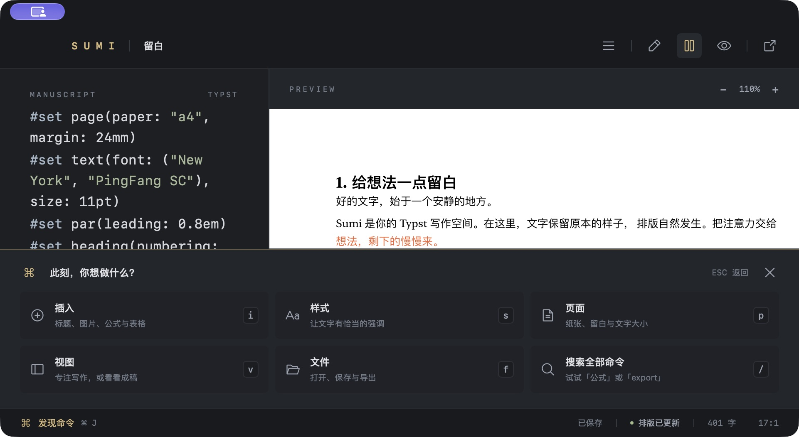

# 实施与验收记录

日期：2026-10-01。首版本地预览版 0.1.0。

## 0.1.1 修复与诊断日志

2026-10-01 用户报告搜索命令后插入崩溃。提供的堆栈在主线程进入 `AppDelegate` 键盘监听闭包，经 `MainActor.assumeIsolated` 的执行器检查触发 `EXC_BAD_ACCESS`。在旧包测试表格、公式路径时未稳定复现，因此没有把随机崩溃归因于某个具体 Typst 命令或声称已证明系统层根因。

改动：

- 移除全应用 `NSEvent` 监听器和 `MainActor.assumeIsolated`，改在 `WritingWindow.sendEvent` 的原生事件路径处理命令；`performKeyEquivalent` 记录菜单快捷键；有文件对话框时不截取主窗口命令。
- 用原生 `NSToolbar.unifiedCompact` 合并顶部文件名与操作按钮，保留系统红黄绿按钮，删除第二行 SUMI 标识栏。
- 新增本地滚动 JSONL 操作日志、启动会话、控制键与命令/插入/保存/导出/服务事件。增加“打开诊断日志”菜单及可搜索命令，现共 35 个命令。
- 日志每份约 1 MiB，保留 3 个归档；不记录正文、剪贴板内容、搜索词和参数值。系统错误描述可能带路径。正常输入只标为 text。

验证：Release 构建和临时签名通过；自动化测试现为 13 项，包含新增日志持久化、跨会话追加、完整日期/毫秒时间及轮转后逐行 JSON 校验。实际 UI 通过搜索表格、修改参数、回车插入、中文占位、Tab、撤销/重做、搜索加粗直接插入、搜索独立公式等路径，应用保持运行。实际日志记录 `command.selected → command.execute → insertion.begin → insertion.finished`；验证日志没有搜索词和文稿片段。搜索“日志”后回车已在 Finder 选中 `events.jsonl`。

当前证据是针对崩溃栈移除了出问题的执行路径，并完成关键操作回归；原始偶发崩溃没有稳定复现，仍需结合后续真实使用和本地日志观察。用户对示例文稿的编辑保留，不纳入本次代码提交。

## 完成范围

- [x] 先完成需求、技术方案和视觉规范，再建立持续实施 goal。
- [x] 固定 Tinymist 0.15.8，校验官方发布包，使用真实协议验证。
- [x] SwiftUI + AppKit 原生应用、Nano 风格深色主题、Phosphor Regular 图标与原创应用图标。
- [x] NSTextView 编辑、克制高亮、系统撤销、查找、占位选区。
- [x] 34 个可发现命令，包含 20 个 Typst 语法命令、中文/英文搜索和参数表单。
- [x] 原子自动保存、外部冲突保护、草稿归档与最近会话恢复。
- [x] Tinymist 诊断、显式补全、标题大纲、服务重启。
- [x] 真实未保存文本预览、可拖动分隔线、预览缩放、源码与预览定位、PDF 导出。
- [x] 多文件主文稿编译入口与子文件未保存缓冲区集成验证。
- [x] 自动化测试、实际 UI 验收、Release 应用和使用文档。

## 工作位置

- 仓库：`/Volumes/SSD/Developer/github/sumi`
- 工作树：`/Volumes/SSD/Developer/Codex/checkouts/sumi-v1`
- 分支：`codex/sumi-v1`
- 交付应用：`build/Sumi.app`
- 未配置远程仓库，未创建 PR 或发布到外部服务。

## 自动化验证

环境为 Apple Silicon、macOS 27、Xcode Swift 6.4，编译目标 macOS 14。构建和测试的临时目录位于 SSD。未使用数据库、Hurl 或容器。

| 命令 | 结果 |
|---|---|
| `scripts/build.sh release` | Release 构建成功，应用包含 arm64 Tinymist |
| `scripts/test.sh` | Swift Testing 共 11 项通过，0 失败 |
| `codesign --verify --deep --strict --verbose=2 build/Sumi.app` | 本机临时签名验证通过 |
| `git diff --check` | 无空白错误 |

10 项核心测试覆盖 UTF-16 中文/emoji/CRLF 位置、逐字节 JSON-RPC 分帧、畸形报头、Typst 参数校验与字符串转义、保留用户字面量、代码围栏、段落分隔、页面规则顺序、外部修改/删除保护、命令查找及恢复数据。

1 项真实集成测试启动与产品相同的 Swift `TinymistClient`，验证：

- 本地预览 HTTP 返回实际前端，未保存文稿可编译，PDF 包含中文和缓冲区内容，源文件磁盘内容不被编译覆盖。
- markup、math、raw、code 上下文，大纲、补全、预览定位命令。
- 无效源码产生诊断和 compileError，PDF 导出明确失败，不复制旧成稿。
- 20 个插入/样式/页面命令逐个成功编译，包括真实 SVG 图片与有效编号目标的交叉引用。
- 服务停止和重启后重新同步；子文稿的未保存修改进入主文稿 PDF。

## 实际 UI 验收

通过真实原生窗口完成以下操作，并在实现过程中修复发现的问题：

| 流程 | 结果 |
|---|---|
| 首次启动、写作、并排与成稿视图 | 原生窗口、图标、中文、公式和实际排版可见 |
| `⌘J` 分组、`/` 搜索、参数表单 | 键盘可操作；快速输入搜索不会写入正文；搜索结果同步 |
| 表格插入与中文选区加粗 | 生成有效源码，选区/占位可见，一次撤销恢复正文 |
| 数学上下文执行正文样式 | 显示解释并保留源码 |
| 中文路径保存、关闭重启 | 文件内容和最近文稿恢复正常 |
| 原生导出对话框 | 成功导出一页 PDF，显示明确成功状态 |
| 故意加入未知函数 | 显示文件名、行号及错误；点击定位；撤销后状态恢复 |
| 双击预览标题 | 回到对应源码行和字符 |
| 预览 100% → 110% | 实际页面字号增大，超出宽度可水平滚动 |
| 分隔线拖动 | 两侧宽度和换行同步调整 |
| 系统四分之一窗口布局 | 约 961×526 pt，正文、预览和六项命令入口仍可用 |

验收用文稿 `.scratch/验收文稿.typ` 和导出 PDF 留在当前工作树的忽略目录。可分享的入门示例位于 `Examples/留白.typ`。

### 实际截图

截图取自运行中的应用，不是设计稿。左上角紫色标记来自系统的屏幕控制提示。

## 明确的限制与未验证项

- 完整中文拼音候选输入、候选切换与第三方输入法仍需人工确认。已实现 marked-text 保护，验证过中文粘贴、选区变换、保存和编译。
- macOS 14/15 实机、Intel 构建、VoiceOver 完整流程、超长文稿性能未验证。当前发布物为 Apple Silicon 本机构建。
- 单窗口、单活动编辑缓冲区；通过预览或诊断打开子文件可保留主入口，暂无独立项目管理器和主文件选择器。
- 页面命令处理文件开头连续 `#set` 规则，不改写任意函数或 `#show` 作用域；后续规则可能覆盖前面设置。
- 语法高亮是有限的视觉辅助。参数化正文命令保守检查选区两端上下文，不替代完整语义重构。
- Tinymist 部分诊断通知不带文档版本，快速输入时可能短暂显示上一轮诊断。
- 没有 Developer ID 签名、公证、App Store 沙盒配置或自动更新；这是本地可运行首版。
- 编辑字号、分屏比例和预览缩放暂不跨启动保存；命令入口快捷键、窗口尺寸及最近文稿会保存。
